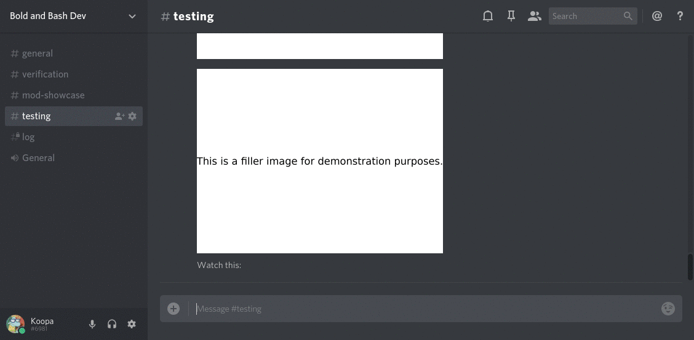
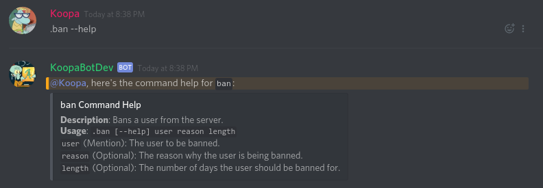

# Bold and Bash
Bold and Bash is a Discord bot made for the [Mario Kart 8 Modding Central](http://discord.gg/K3ERBFC), based off of [CitraBot](https://github.com/citra-emu/discord-bot). It shares some functionality with the [Bash](https://www.gnu.org/software/bash/) shell, as the name implies. Some examples of said functionality are the help commands, analogous to a command's manpage, and the stringing of commands together with `&&`.

## Setup

### Prerequisites
- [Git](https://git-scm.com/) is required to clone this repository.
- [Docker](https://www.docker.com/) is required to run Bold and Bash in a containerized environment.
- [Node.js](https://nodejs.org/) is required, alternatively to Docker, to run Bold and Bash directly on the host.

### Instructions
In this section, for Docker instructions, there will be two code samples:
- A Bash command for use with with the Docker CLI.
- A [Docker Compose](https://docs.docker.com/compose/overview/) `yml` configuration, with `version: "3.7"`.

Which one of these two you follow depends on whether or not you use Docker Compose in your setup. **Either way, the Docker excerpts from different subheadings should be combined into a final command or `yml`.**

#### Discord Setup
1. Create a Discord server.
2. Modify the `@everyone` role to take away the `Send Messages` permission in the `Text Permissions` section.
3. Make 4 roles (These must be named exactly how they are typed here, unless noted otherwise.):
- The `Admins` role. These are administrators, the staff with the most power. The permissions are up to you.
- The `Moderators` role. These are moderators, staff members with less power than the administrators. The permissions are up to you.
- The Bold and Bash role (The name of this role is up to you.). This is the bot's role. The permissions must grant:
  - `Manage Roles` for the `verify` command.
  - `Ban Members` for the `ban` command.
  - `Read Text Channels & See Voice Channels` to receive commands.
  - `Send Text Messages` to respond to commands.
  - `Manage Messages` to delete entered commands that ended successfully, and clean up the verification channel.
- The `Verified` role. The permissions should have everything except for `Send Messages` **disabled**, with `Send Messages` itself **enabled**.
4. Make 3 text channels in addition to the default `#general` channel (The names are up to you.):
- The welcome channel. This contains info about the server. The permissions are up to you.
- The verification channel. This is where people will enter the `verify` command to give themselves the permission to send messages. The permissions must be:
  - `@everyone` is granted the `Read Messages` and `Send Messages` permissions.
  - `Verified` is denied the `Read Messages` permission (`Send Messages` is neutral.).
  - `Admins` and `Moderators` is granted the `Read Messages` permission.
- The mod showcase channel. This is where the bot will post mod updates on behalf of people using the `showcase` command. The permissions must be:
  - `@everyone` is denied the `Send Messages` permission.
  - `Admins`, `Moderators`, and the bot have the `Send Messages` permission.
- The log channel. This is where the bot reports events like warns or bans that are of interest to the staff. The permissions must be:
  - `@everyone` is denied the `Read Messages` permission.
  - `Admins`, `Moderators`, and the bot have the `Read Messages` permission.
5. Make a bot user using [this](https://discordapp.com/developers/docs/intro) guide.
6. Invite the bot to the server using [this](https://discordapp.com/developers/docs/topics/oauth2#bot-authorization-flow) guide. For the permissions, just use `0`, because we already have a role with the bot's permissions.
7. Give the bot role to the newly invited bot.

#### Bot Setup
1. Open up a terminal or command prompt.
2. Clone the `bold-and-bash` repository:
```bash
git clone https://gitlab.com/mk8mc/web/bold-and-bash
```
3. Enter the `bold-and-bash` directory:
```bash
cd bold-and-bash
```
4. Make an environment file (e.g. `.env`) setting the configuration variables specified in [`env.json`](env.json). Any fields for which default variables are provided may be omitted. Example excerpt:
```bash
BAB_CUSTOM_PLAYING_STATUSES_ENABLED=true
BAB_TOKEN=XXXXXXXXXXXXXXXXXXXXXXXX.XXXXXX.XXXXXXXXXXXXXXXXXXXXXXXXXXXX
BAB_LOG_CHANNEL_ID=000000000000000000
BAB_SHOWCASE_CHANNEL_ID=000000000000000000
BAB_VERIFICATION_CHANNEL_ID=000000000000000000
BAB_WELCOME_CHANNEL_ID=000000000000000000
BAB_PEFIX=.
BAB_INVITE_LINK=http://discord.gg/fortnite
```

##### Bot Setup with Docker
In this section, there will be two code samples for each step:
- A Bash command for use with with the Docker CLI.
- A [Docker Compose](https://docs.docker.com/compose/overview/) `yml` configuration, with `version: "3.7"`.

Which one of these two you follow depends on whether or not you use Docker Compose in your setup. **Either way, the Docker excerpts should be combined into a final command or `yml`.**

1. Run the bot (see the steps after this before running this!):
```bash
docker run --env-file .env registry.gitlab.com/mk8mc/web/bold-and-bash/amd64:stable
```
```yml
services:
  bold-and-bash:
    image: registry.gitlab.com/mk8mc/web/bold-and-bash/amd64:stable
    env_file: /opt/bold-and-bash/.env
```
2. Make the bot restart if it crashes (Optional.):
```bash
docker run --restart on-failure
```
```yml
services:
  bold-and-bash:
    restart: on-failure
```
3. Use the `Data` mount point to create a volume:
```bash
docker run --mount type=volume,source=bab-data,target=/usr/src/app/Data
```
```yml
services:
  bold-and-bash:
    volumes:
      - type: volume
        source: bab-data
        target: /usr/src/app/Data
```

##### Bot Setup without Docker
1. Export the configuration variables. This can be done by turning the aforementioned environment file into a script that exports the variables, or a Bash function like so:
```bash
# Exports the contents of an "ENV" file.
# Arguments:
#   - The path to the "ENV" file.
function export-env
{
  set -o allexport
  # shellcheck disable=1090
  source "$1"
  set +o allexport
}
```
2. Install the Node.js dependencies with the [NPM](https://www.npmjs.com/) package manager:
```bash
npm install
```
3. Run the bot:
```bash
npm run start
```

## Features
A full list of commands be found by running the `help` command.

### `&&`ing Commands
This wouldn't be a Bash-themed bot without `&&`. For the uninformed, `&&` allows you to execute multiple commands, but from one line of input. If one command fails, then the rest will not be executed. Here's a demonstration:


## Command Help
Every command comes with an automatically generated help embed, similiar to a Bash command's manpage.


### Moderation
The `ban` and `warn` commands ban or warn users for a reason. The former supports banning a user for a number of days, for temporary suspensions. The latter supports automatically permenantly banning someone when they have been warned 3 times.

Additionally, Bold and Bash logs messages to `MessageLogs/Date.Messages.log`, so if you need to see what someone said in a deleted message, it can be found here. Logs are also padded to make them easier to look at. Here's an excerpt from the non-messages log:
```
[info]    [7:21 PM]  Bold and Bash Version 0.0.1 Starting.
[info]    [7:21 PM]  Loading Command Modules.
[debug]   [7:21 PM]  Loaded module: Ban.js
```
And here's an excerpt from the messages log:
```
[#general    ] Koopa        (168559677913694208): Hey <@202614166689677312> can you say something?
[#general    ] Koopa        (168559677913694208): I'm getting an example of the message log for the Bold & Bash readme.
[#general    ] Hexexpeck    (202614166689677312): test 1
[#general    ] Koopa        (168559677913694208): Thanks~
[#verificatio] Koopa        (168559677913694208): And just for good measure, here's a message in another channel.
```

### Verification
In compliance with [section 2.4 of the Discord Developer Terms of Service](https://discordapp.com/developers/docs/legal#2-license-accounts-and-restrictions), Bold and Bash gets permission from all users before retaining chat logs. In order for a user to send messages in a server, they must run the `verify` command to have the bot give them the `Verified` role that gives them the permission. By running this command, users give permission to the bot owner to keep their "end user data".

This system does have pros outside of the legal stuff though. By making users have to look for a command before particiating in a community, they have to at least take a quick look at the rules.

### Mod Showcasing
In a modding server, generally people will have mods to share. However, in a channel dedicated to this purpose, one mod being shared can lead to offtopic discussion, making it hard to find new mods. So, with this system, the mod showcase channel is read only, and users run a command to submit a mod from another channel. Here's an example of what the bot's message looks like:


## License
Bold and Bash is licensed under the GNU General Public License v2.0.
